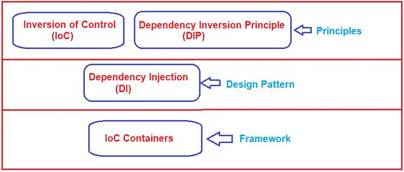
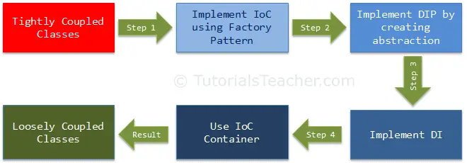

<h6> Ảnh mô hình so sánh IoC, DIP, DI, & IoC containers</h6>

<ul>
	<li> IoC và DIP là các nguyên tắc thiết kế cấp cao nên được sử dụng khi thiết kế các lớp ứng dụng
	<li> Dependency Injection (DI) là một mẫu và IoC container là một khung.
</ul>
<ul>
<strong>Inversion of Control </strong>
	<li> IoC là một nguyên tắc thiết kế khuyến nghị việc đảo ngược các loại điều khiển khác nhau trong thiết kế hướng đối tượng để đạt được sự liên kết lỏng lẻo giữa các lớp ứng dụng. Trong trường hợp này, quyền kiểm soát đề cập đến bất kỳ trách nhiệm bổ sung nào mà một lớp có, ngoài trách nhiệm chính của nó, chẳng hạn như kiểm soát luồng của ứng dụng hoặc kiểm soát việc tạo và ràng buộc đối tượng phụ thuộc  </li>
<strong>Dependency Inversion Principle </strong>	
	<li> Nguyên tắc DIP cũng giúp đạt được sự liên kết lỏng lẻo giữa các lớp. Chúng tôi khuyên bạn nên sử dụng DIP và IoC cùng nhau để đạt được khả năng ghép nối lỏng lẻo.DIP gợi ý rằng các mô-đun cấp cao không nên phụ thuộc vào các mô-đun cấp thấp. Cả hai nên phụ thuộc vào sự trừu tượng. <li>
<strong>Dependency Injection </strong>	
	<li> là một mẫu thiết kế thực hiện nguyên tắc IoC để đảo ngược việc tạo các đối tượng phụ thuộc. <li>
<strong>IoC Container </strong>	

</ul>

